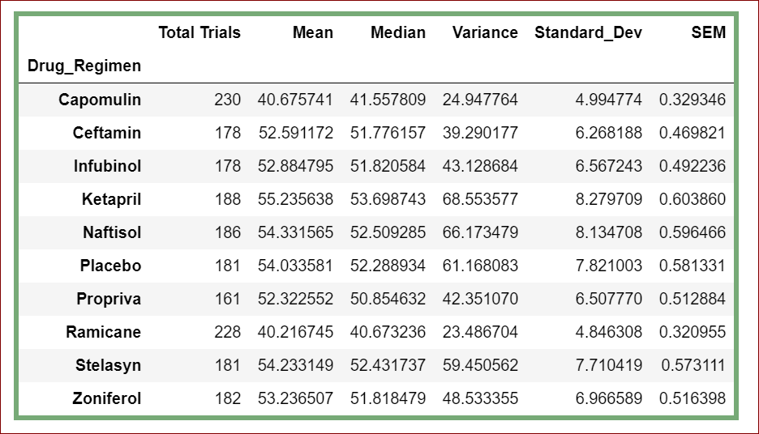
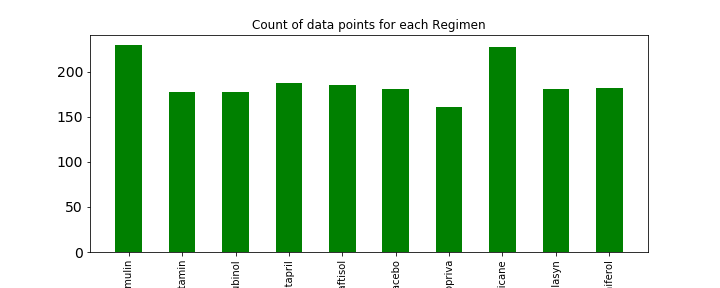
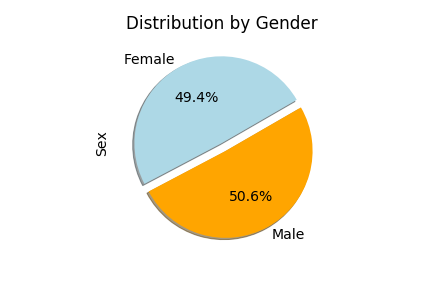
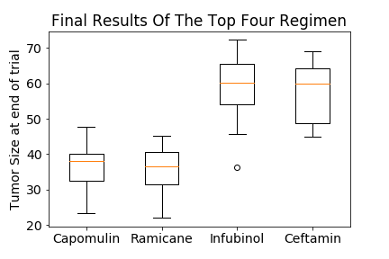
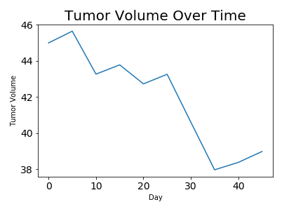
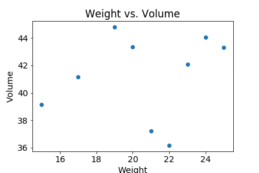
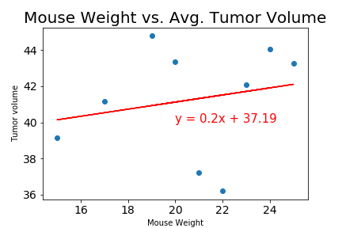

# Matplotlib-Homework

Pymaceuticals specializes in anti-cancer pharmaceuticals. In its most recent efforts, it began screening for potential treatments for squamous cell carcinoma (SCC), a commonly occurring form of skin cancer.

The purpose of this study was to compare the performance of Pymaceuticals' drug of interest, Capomulin, versus the other treatment regimens.

**Summary table**

**Number of data points for each drug regimen above 100**

**Male and Female Distribution**

**Final measureof tumor volume by drug regimen**

**Tumor volume over period**

**Weight vs. Volume**

**Weight vs. Avg Volume**

